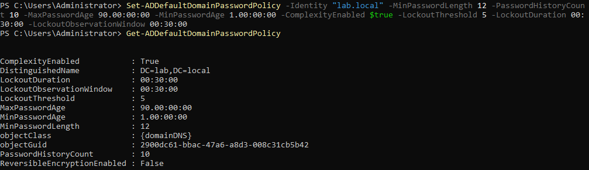
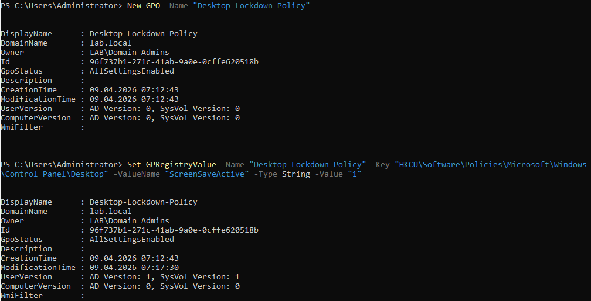
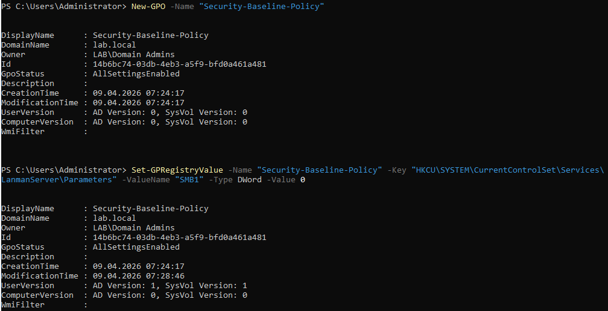
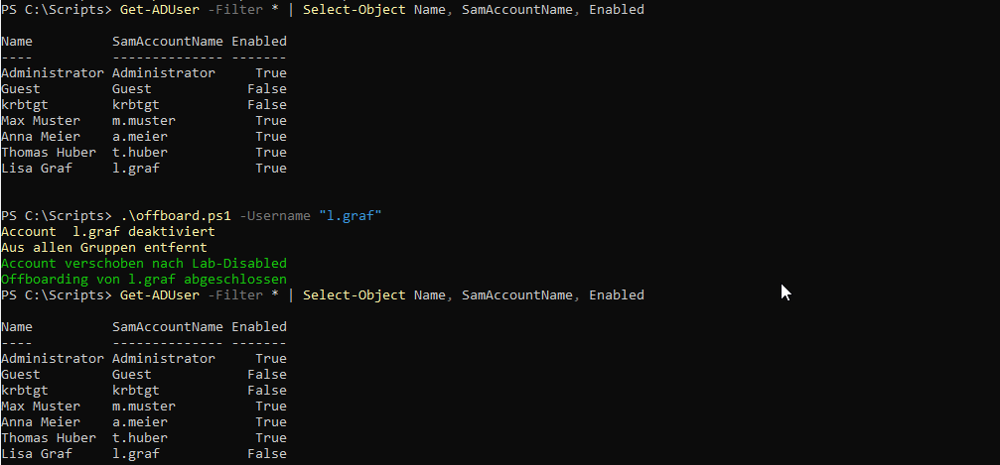

# Active Directory Home Lab

A fully functional Active Directory environment built on Windows Server 2022, simulating a real SME (small/medium enterprise) network. Deployed on VirtualBox for hands-on IT administration practice.

-----

## Environment

|Component         |Details                     |
|------------------|----------------------------|
|OS                |Windows Server 2022 Standard|
|Domain            |`lab.local`                 |
|Domain Controller |DC01 (192.168.56.10)        |
|Forest/Domain Mode|Windows2016Forest           |
|Virtualization    |Oracle VirtualBox           |
|Network           |Host-Only Adapter (isolated)|

-----

## What Was Built

### 1. Active Directory Domain Services (AD DS)

- Deployed a fully functional domain controller (`DC01`)
- Configured DNS integrated with AD
- Verified FSMO roles: RIDMaster, SchemaMaster, DomainNamingMaster all on DC01

### 2. Organisational Unit (OU) Structure

Designed to simulate a real company with department-based access control:

```
lab.local
├── Lab-Users
│   ├── IT
│   ├── HR
│   └── Management
├── Lab-Computers
├── Lab-Groups
├── Lab-ServiceAccounts
└── Lab-Disabled
```

### 3. Group Policy Objects (GPOs)

#### GPO 1 – Password Policy (Domain-wide)

Applied to entire domain via `DC=lab,DC=local`

|Setting                |Value            |
|-----------------------|-----------------|
|Minimum Password Length|12 characters    |
|Complexity             |Enabled          |
|Max Password Age       |90 days          |
|Password History       |10 passwords     |
|Lockout Threshold      |5 failed attempts|
|Lockout Duration       |30 minutes       |

#### GPO 2 – Desktop Lockdown Policy

Applied to `OU=HR` and `OU=Management` only (not IT admins)

|Setting            |Value            |
|-------------------|-----------------|
|Screensaver        |Enabled          |
|Screensaver Timeout|10 minutes (600s)|
|Password on Resume |Enabled          |

#### GPO 3 – Security Baseline Policy

Applied domain-wide via `DC=lab,DC=local`

|Setting                      |Value          |
|-----------------------------|---------------|
|SMBv1                        |Disabled       |
|NTLMv1 (LmCompatibilityLevel)|5 (NTLMv2 only)|

### 4. User Lifecycle Automation (PowerShell)

Two scripts automate the full user lifecycle:

**`onboard.ps1`** – Creates a new AD user with:

- Automatic username generation (`firstname.lastname`)
- Department-based OU placement
- Secure default password
- Account enabled on creation

**`offboard.ps1`** – Offboards a user:

- Disables the account
- Removes from all groups
- Moves to `Lab-Disabled` OU
- Full audit trail via console output

-----

## Screenshots

### Password Policy



### Desktop Lockdown GPO – Linked to HR & Management



### Security Baseline GPO – Linked to Domain



### User Onboarding Script


### User Offboarding Script



-----

## Scripts

|Script                                |Description               |
|--------------------------------------|--------------------------|
|[`onboard.ps1`](scripts/onboard.ps1)  |Automated user onboarding |
|[`offboard.ps1`](scripts/offboard.ps1)|Automated user offboarding|

### Usage

```powershell
# Onboard a new employee
.\onboard.ps1 -FirstName "Max" -LastName "Muster" -Department "IT"

# Offboard a leaving employee
.\offboard.ps1 -Username "m.muster"
```

-----

## Skills Demonstrated

- Windows Server 2022 administration
- Active Directory DS deployment and configuration
- OU design and delegation planning
- Group Policy Object (GPO) creation and linking
- PowerShell automation for user lifecycle management
- Security hardening (SMBv1, NTLMv1, password policy)
- Department-based access control design
